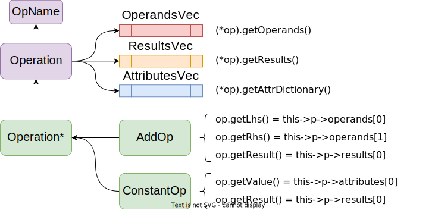

# Hands-On Practical MLIR Tutorial

Kexing Zhou（周可行）

北京大学

zhoukexing@pku.edu.cn

<!-- vscode-markdown-toc -->
* 1. [MLIR 简介](#mlir-简介)
  * 1.1. [MLIR 编译管线](#mlir-编译管线)
  * 1.2. [常见的 Dialect](#常见的-dialect)
  * 1.3. [insight：“及时做优化”](#insight：“及时做优化”)
  * 1.4. [MLIR 的用处](#mlir-的用处)
  * 1.5. [MLIR 的缺点](#mlir-的缺点)
* 2. [MLIR 基本用法](#mlir-基本用法)
  * 2.1. [IR 基本结构](#ir-基本结构)
  * 2.2. [MLIR 基本工程模板](#mlir-基本工程模板)
    * 2.2.1. [配置 clangd](#配置-clangd)
  * 2.3. [MLIR 的读入、输出](#mlir-的读入、输出)
  * 2.4. [用代码生成 MLIR](#用代码生成-mlir)
* 3. [MLIR Op 的结构](#mlir-op-的结构)
  * 3.1. [Attribute 和 Operand](#attribute-和-operand)
  * 3.2. [Attribute, Value 和 Type](#attribute,-value-和-type)
* 4. [MLIR 的类型转换](#mlir-的类型转换)
  * 4.1. [Op 的类型转换](#op-的类型转换)
  * 4.2. [Type / Attribute 的类型转换](#type-/-attribute-的类型转换)
* 5. [MLIR 的图结构](#mlir-的图结构)
  * 5.1. [MLIR 数据流图结构](#mlir-数据流图结构)
  * 5.2. [MLIR 数据流图的遍历与修改](#mlir-数据流图的遍历与修改)
  * 5.3. [MLIR 控制流图的遍历与修改](#mlir-控制流图的遍历与修改)
* 6. [基本的 Dialect 工程](#基本的-dialect-工程)
  * 6.1. [TableGen 工程模板](#tablegen-工程模板)
  * 6.2. [Tablegen Language Server](#tablegen-language-server)
  * 6.3. [IR 的默认定义与实现](#ir-的默认定义与实现)
    * 6.3.1. [TableGen 文件](#tablegen-文件)
    * 6.3.2. [头文件](#头文件)
    * 6.3.3. [库文件](#库文件)
    * 6.3.4. [程序入口](#程序入口)
* 7. [TableGen Op 定义详解](#tablegen-op-定义详解)
  * 7.1. [Attribute、Type、Constraint](#attribute、type、constraint)
    * 7.1.1. [内置 Attribute](#内置-attribute)
    * 7.1.2. [内置的 Type](#内置的-type)
    * 7.1.3. [为什么 Attribute 和 Type 都是 Constraint](#为什么-attribute-和-type-都是-constraint)
  * 7.2. [Verifier：发现IR错误](#verifier：发现ir错误)
    * 7.2.1. [emitError](#emiterror)
    * 7.2.2. [LogicalResult](#logicalresult)
  * 7.3. [Variadic：可变参数](#variadic：可变参数)
    * 7.3.1. [多个可变参数：AttrSizedOperandSegments](#多个可变参数：attrsizedoperandsegments)
  * 7.4. [AssemblyFormat：更易读的输出](#assemblyformat：更易读的输出)
    * 7.4.1. [常用关键字](#常用关键字)
    * 7.4.2. [额外 attr 字典](#额外-attr-字典)
    * 7.4.3. [输出 type](#输出-type)
    * 7.4.4. [可选输出：Optional、UnitAttr](#可选输出：optional、unitattr)
  * 7.5. [Builder：自定义 create 函数](#builder：自定义-create-函数)
    * 7.5.1. [默认Builder](#默认builder)
    * 7.5.2. [自定义builder](#自定义builder)
  * 7.6. [自定义函数](#自定义函数)
    * 7.6.1. [header target](#header-target)
  * 7.7. [使用 Trait](#使用-trait)
    * 7.7.1. [内存副作用：SideEffectInterfaces](#内存副作用：sideeffectinterfaces)
    * 7.7.2. [类型推断：InferTypeOpInterface](#类型推断：infertypeopinterface)
  * 7.8. [函数：FunctionOpTrait](#函数：functionoptrait)
    * 7.8.1. [定义 Return](#定义-return)
    * 7.8.2. [定义 Function](#定义-function)
    * 7.8.3. [定义 Call](#定义-call)
* 8. [添加 Pass](#添加-pass)
  * 8.1. [Pass 工程模板](#pass-工程模板)
  * 8.2. [Pass 定义详解](#pass-定义详解)
    * 8.2.1. [指定 Pass 在哪个 Op 上运行](#指定-pass-在哪个-op-上运行)
    * 8.2.2. [带参数的 Pass](#带参数的-pass)
  * 8.3. [简单的 DCE Pass 实现](#简单的-dce-pass-实现)
    * 8.3.1. [定义](#定义)
    * 8.3.2. [实现](#实现)
* 9. [Pattern Rewrite](#pattern-rewrite)
  * 9.1. [Pattern Rewrite](#pattern-rewrite-1)
    * 9.1.1. [描述 Pattern](#描述-pattern)
    * 9.1.2. [调用 Pattern](#调用-pattern)
    * 9.1.3. [Depedent Dialect & Linking](#depedent-dialect-&-linking)
  * 9.2. [Dialect Convertion (Type Conversion)](#dialect-convertion-(type-conversion))
    * 9.2.1. [TypeConverter](#typeconverter)
    * 9.2.2. [Conversion Pattern：自动做 Operand 的类型转换](#conversion-pattern：自动做-operand-的类型转换)
    * 9.2.3. [类型转换的细节与 Debug](#类型转换的细节与-debug)
    * 9.2.4. [使用自己的 materialization](#使用自己的-materialization)
  * 9.3. [使用 MLIR 里已有的 Pattern 做多步转换](#使用-mlir-里已有的-pattern-做多步转换)
* 10. [自定义 Type](#自定义-type)
* 11. [TIPS](#tips)
  * 11.1. [如何找头文件、找想要的函数](#如何找头文件、找想要的函数)
  * 11.2. [如何找需要连接的库](#如何找需要连接的库)
  * 11.3. [如何加快编译速度](#如何加快编译速度)
  * 11.4. [去 MLIR 里抄代码](#去-mlir-里抄代码)
* 12. [MLIR 的批判：C++ v.s. Rust](#mlir-的批判：c++-v.s.-rust)
* 13. [Issue & Reply](#issue-&-reply)

<!-- vscode-markdown-toc-config
	numbering=true
	autoSave=true
	/vscode-markdown-toc-config -->
<!-- /vscode-markdown-toc -->


##  1. <a name='mlir-简介'></a>MLIR 简介

###  1.1. <a name='mlir-编译管线'></a>MLIR 编译管线

MLIR 在于设计一套可复用的编译管线，包括可复用的 IR、Pass 和 IO 系统。在 IR 中，多个 Dialect 可以混合存在。MLIR 已经定义好了一套 Dialect Translation Graph：


###  1.2. <a name='常见的-dialect'></a>常见的 Dialect

MLIR 的 Dialect 是相对独立的，下面列举一些常见的 dialect：

1. **func**：处理函数的dialect，包含的函数定义、调用、返回等基本操作
2. **arith**：处理加减乘除移位等各种运算
    * **math**：更复杂的运算，如 log, exp, tan 等
3. **affine**：处理循环嵌套，实现了循环展开、多面体变换等一些算法
4. **scf**：(structured control flow) 结构化控制流，保留 for，if 等语句
    * **cf**：无结构控制流，只有条件跳转命令
5. **llvm**：LLVM IR 的 binding，可以直接翻译给 LLVM 做后续编译

MLIR的编译从高层次的 tensor 到 低层次的 scf,cf，每个阶段都是多个 dialect 的混合体，每次 lowering 往往只针对一个 dialect 进行。

<!-- ### MLIR Lowering 流程


从下面的代码开始，逐渐 lower 到 LLVM IR

```mlir
func.func @foo(%a: tensor<16x64xf64>, %b: tensor<16x64xf64>) -> tensor<16x64xf64> {
  %c = arith.addf %a, %b : tensor<16x64xf64>
  func.return %c : tensor<16x64xf64>
}
```

首先，将 tensor 运算转换为循环，命令是

```bash
mlir-opt \
  -convert-elementwise-to-linalg \
  -func-bufferize \
  -linalg-bufferize \
  -convert-linalg-to-affine-loops
```

```mlir
// affine
func.func @foo(%arg0: memref<16x64xf64>, %arg1: memref<16x64xf64>) -> memref<16x64xf64> {
  %alloc = memref.alloc() {alignment = 64 : i64} : memref<16x64xf64>
  affine.for %i = 0 to 16 {
    affine.for %j = 0 to 64 {
      %0 = affine.load %arg0[%i, %j] : memref<16x64xf64>
      %1 = affine.load %arg1[%i, %j] : memref<16x64xf64>
      %2 = arith.addf %0, %1 : f64
      affine.store %2, %alloc[%i, %j] : memref<16x64xf64>
    }
  }
  return %alloc : memref<16x64xf64>
}
```

然后 -->

###  1.3. <a name='insight：“及时做优化”'></a>insight：“及时做优化”

这里简单举例，dialect 是如何混合的。

例如，我是 pytorch，生成了一些神经网络，我想要表示这些运算：

* Tensor 是一块带 shape 的指针：使用 **tensor** dialect
* 简单的 elementwise 加减乘除：使用 **arith** dialect
* 复杂的 log、exp 等运算：使用 **math** dialect
* 矩阵线性代数运算：使用 **linalg** dialect
* 可能有一些控制流：使用 **scf** dialect
* 整个网络是一个函数：使用 **func** dialect

接下来，将其逐渐 lower 到 LLVM：

* 调用 Lowering Pass，把 **tensor** lowering 到 **linalg**，<u>而其他的 dialect 不会改变</u>。
* 继续调用 pass，直到把 **linalg** 转换到 **affine** -> **scf** -> **cf**，<u>其他表示运算的 dialect 保留不变</u>。
* 继续 Lowering，把 **memref** 转换为裸指针、**arith** 和 **func** 转换为 llvm 内置运算。
* 最后，所有非 **llvm** dialect 都被转换为了 **llvm** dialect，现在可以导出为 llvm ir 交给 llvm 继续编译。

**可见，MLIR 编译有一个特点**：不同 dialect 是独立的。

* 例如，在做循环展开等优化的时候，我不需要关心加法和减法可以合并；而在做算数表达式优化的时候，也不需要关心当前在哪个函数里边。
<!-- * 在我们利用 mlir 写新项目的时候，往往可以利用已有的 **arith** 等 dialect 用来表示运算。 -->

**MLIR 可以从各个层次优化 IR**：例如：

* 在 **affine** 层面，可以根据循环大小做展开，向量化
* 在 **scf**   层面，可以发现循环不变量
* 在 **arith** 层面，可以用算数恒等式优化代码

MLIR 的 insight 在于“**及时做优化**”。很明显，linalg 层次，我们很容易发现矩阵被转置了两次，但一旦 lower 到 scf，所有转置操作都变成循环，优化就很难进行了。

###  1.4. <a name='mlir-的用处'></a>MLIR 的用处

我们使用 MLIR，主要也是想要复用别人已经写好的代码，一般包括：

* 复用已有 dialect 作为 **输入**，不用自己写前端。
    * 如 Polygeist 能把 C 翻译成 Affine Dialect，这样我们就不用写 C Parser
* 将已有 dialect **混入**或**作为输出**。
    * 如 arith 等 dialect，可以直接集成起来，不需要自己写。
    * 要生成 binary 的时候，可以直接生成 LLVM Dialect，复用后端 LLVM 编译管线
* 复用已有的 Pass。
    * 常见的 Pass 如 CSE，DCE 可以复用
    * Dialect 专用 Pass，如循环展开，也可以复用

###  1.5. <a name='mlir-的缺点'></a>MLIR 的缺点

MLIR 也有缺点：

* 太过笨重，编译、链接时间长（可能会连接出上百M的文件）
  * 可以用 lld 来加快链接速度，但依然很慢 [见TIPS](#113-如何加快编译速度)
* Dialect 定义极不灵活，定义较复杂 Op 时非常麻烦

##  2. <a name='mlir-基本用法'></a>MLIR 基本用法

###  2.1. <a name='ir-基本结构'></a>IR 基本结构

MLIR 是 树形结构，每个节点是 Operation，Op 可以组成 Block，Block 组成 Region，而 Region 又可以嵌套在 Op 内部。

* **Operation** 指单个运算，运算内可以嵌套 **Region**
* **Block** 指基本块，基本块包含一个或多个 **Operation**
* **Region** 指区域，类似于循环体或函数体，包含若干 **Block**

MLIR 的基本块使用 **“基本块参数”** 来取代“phi函数”，如下面的例子：

* **块参数**：每个基本块都带有参数，块内可以使用
* **终止符**：每个基本块的一般为跳转或返回，跳转时需要附上块参数

```mlir
module {
func.func @foo(%a: i32, %b: i32, %c: i32) -> i32 {
  %cmp = arith.cmpi "sge", %a, %b : i32
  cf.cond_br %cmp, ^add(%a: i32), ^add(%b: i32)
^add(%1: i32):
  %ret = llvm.add %1, %c : i32
  cf.br ^ret
^ret:
  func.return %ret : i32
}
}
```

**module**: 默认情况下，mlir 最外层是 `builtin.module`，作为 IR 的根。

###  2.2. <a name='mlir-基本工程模板'></a>MLIR 基本工程模板

构建第一个 mlir 项目往往非常困难，下面给一个我常用的工程模板：

```
mlir-tutorial
├── install       # Install Prefix，把 MLIR 编译后安装到这里
├── llvm-project  # MLIR 项目
└── mlir-toy      # 自己的 MLIR 工程
```

首先，按照 MLIR [getting started](https://mlir.llvm.org/getting_started/) 的方法，安装 MLIR。注意，安装的时候要设置 PREFIX 为 install 目录，如下面所示，和 getting start 上的略有区别：

```bash
git clone https://github.com/llvm/llvm-project.git
cd llvm-project
git checkout 186a4b3b657878ae2aea23caf684b6e103901162 # 本教程使用的版本
mkdir build && cd build
cmake -G Ninja ../llvm \
  -DCMAKE_INSTALL_PREFIX=/mlir-tutorial/install \
  -DLLVM_ENABLE_PROJECTS=mlir \
  -DLLVM_BUILD_EXAMPLES=ON \
  -DLLVM_TARGETS_TO_BUILD="Native;NVPTX;AMDGPU" \
  -DCMAKE_BUILD_TYPE=Release \
  -DLLVM_ENABLE_ASSERTIONS=ON
```

在 build 完之后，安装到 prefix

```bash
ninja install
```

现在，mlir 把所有二进制文件、库文件都装到了 install 目录下。现在可以 `export PATH=/mlir-tutorial/install/bin:$PATH`，方便调用 `bin` 里面的 `mlir-opt` 等程序。

```bash
install
├── bin
├── examples
├── include
├── lib
└── share
```

接下来，在 mlir-toy 里面建立一个简单的工程

```bash
mlir-toy
├── CMakeLists.txt
└── main.cpp
```

其中 CMakeLists.txt 文件写法比较固定：

```cmake
cmake_minimum_required(VERSION 3.13.4)

project(mlir-toy VERSION 0.0.0)

set(CMAKE_EXPORT_COMPILE_COMMANDS ON) # 生成 compile_commands.json 便于代码高亮
set(CMAKE_CXX_STANDARD 17)
set(CMAKE_CXX_STANDARD_REQUIRED YES)

find_package(MLIR REQUIRED CONFIG)
list(APPEND CMAKE_MODULE_PATH "${MLIR_CMAKE_DIR}")
list(APPEND CMAKE_MODULE_PATH "${LLVM_CMAKE_DIR}")

include(TableGen)
include(AddLLVM)
include(AddMLIR)
include(HandleLLVMOptions)

include_directories(${LLVM_INCLUDE_DIRS} ${MLIR_INCLUDE_DIRS})

add_executable(mlir-toy main.cpp)
```

在 main.cpp 里面写一个 main 函数，然后先 build 一下。注意，必须要写上 `CMAKE_INSTALL_PREFIX`，这样cmake 可以自动找到 MLIR。

```bash
cd build
cmake .. -GNinja -DCMAKE_INSTALL_PREFIX=/mlir-tutorial/install
ninja
```

####  2.2.1. <a name='配置-clangd'></a>配置 clangd

使用 vscode 默认的 lint 工具跑 mlir 会非常卡，建议使用 clangd。

* 在扩展里安装 clangd 插件
* cmake 的时候加上 `-DCMAKE_EXPORT_COMPILE_COMMANDS=ON`（上面的CMakeLists.txt 已经加上了）
* 有时候要吧 compile_commands.json 拷贝到工程根目录，或者在 vscode 设置里配置一下
* 一旦发现高亮炸了，vscode里 Ctrl + Shift + P，输入 clangd: restart language server
* 有时候，mlir 的编译选项与 clangd 冲突，在 mlir-toy 目录下建立 .clangd 文件，去掉相关的选项：
    ```yaml
    CompileFlags:
      Remove:
        - -fno-lifetime-dse
    ```

###  2.3. <a name='mlir-的读入、输出'></a>MLIR 的读入、输出

测试用 mlir：

```mlir
func.func @test(%a: i32, %b: i32) -> i32 {
  %c = arith.addi %a, %b : i32
  func.return %c : i32
}
```

最简单的读入输出：

```cpp
#include "mlir/IR/AsmState.h"
#include "mlir/IR/BuiltinOps.h"
#include "mlir/IR/MLIRContext.h"
#include "mlir/Parser/Parser.h"
#include "mlir/Support/FileUtilities.h"
#include "mlir/Dialect/Func/IR/FuncOps.h"
#include "mlir/Dialect/Arith/IR/Arith.h"
#include "llvm/Support/raw_ostream.h"

using namespace mlir;

int main(int argc, char ** argv) {
  MLIRContext ctx;
  // 首先，注册需要的 dialect
  ctx.loadDialect<func::FuncDialect, arith::ArithDialect>();
  // 读入文件
  auto src = parseSourceFile<ModuleOp>(argv[1], &ctx);
  // 输出dialect，也可以输出到 llvm::errs(), llvm::dbgs()
  src->print(llvm::outs());
  // 简单的输出，在 debug 的时候常用
  src->dump();
  return 0;
}
```

需要连接上所有依赖的文件：

```cmake
target_link_libraries(
  ex1-io
  MLIRIR
  MLIRParser
  MLIRFuncDialect
  MLIRArithDialect
)
```

测试方式：

```bash
./ex1-io ../ex1-io/ex1.mlir
```

###  2.4. <a name='用代码生成-mlir'></a>用代码生成 MLIR

```cpp
#include "mlir/IR/AsmState.h"
#include "mlir/IR/Builders.h"
#include "mlir/IR/BuiltinOps.h"
#include "mlir/IR/MLIRContext.h"
#include "mlir/Parser/Parser.h"
#include "mlir/Support/FileUtilities.h"

#include "mlir/Dialect/Func/IR/FuncOps.h"
#include "mlir/Dialect/Arith/IR/Arith.h"
#include "llvm/Support/raw_ostream.h"

using namespace mlir;

int main(int argc, char ** argv) {
  MLIRContext ctx;
  ctx.loadDialect<func::FuncDialect, arith::ArithDialect>();

  // 创建 OpBuilder
  OpBuilder builder(&ctx);
  auto mod = builder.create<ModuleOp>(builder.getUnknownLoc());

  // 设置插入点
  builder.setInsertionPointToEnd(mod.getBody());

  // 创建 func
  auto i32 = builder.getI32Type();
  auto funcType = builder.getFunctionType({i32, i32}, {i32});
  auto func = builder.create<func::FuncOp>(builder.getUnknownLoc(), "test", funcType);

  // 添加基本块
  auto entry = func.addEntryBlock();
  auto args = entry->getArguments();

  // 设置插入点
  builder.setInsertionPointToEnd(entry);

  // 创建 arith.addi
  auto addi = builder.create<arith::AddIOp>(builder.getUnknownLoc(), args[0], args[1]);

  // 创建 func.return
  builder.create<func::ReturnOp>(builder.getUnknownLoc(), ValueRange({addi}));
  mod->print(llvm::outs());
  return 0;
}
```

**如何寻找 builder.create 的参数**：builder.create 内部是调用 `Op::build` 函数的，你可以 Ctrl + 鼠标点击找到 `func::FuncOp` 的定义，然后找里面的 build 函数，看参数表。

##  3. <a name='mlir-op-的结构'></a>MLIR Op 的结构

MLIR 的一个 Operation 里可以包含下面的一些东西：

* Operand：这个 Op 接受的操作数
* Result：这个 Op 生成的新 Value
* Attribute：可以理解为编译器常量
* Region：这个 Op 内部的 Region

MLIR 中，Attribute 是高度灵活的，允许插入原来不存在的 attr，允许不同 dialect 互相插入 attribute。

###  3.1. <a name='attribute-和-operand'></a>Attribute 和 Operand

Attribute 和 Operand 有一些区别。Attribute 指的编译器已知的量，而 Operand 指只有运行时才能知道的量。

如下面的这个Op，0 是一个 Attribute 而不是一个 Operand

```mlir
%c0 = arith.constant 0 : i32
```

###  3.2. <a name='attribute,-value-和-type'></a>Attribute, Value 和 Type

Value 必然包含 Type，Type 也可以作为 Attribute 附加在 Operation 上。

例如函数 Op，虽然 %a, %b 出现在了参数表里，但它们实际上是函数类型的一部分，算是 Type Attribute。

```mlir
func.func @test(%a: i32, %b: i32) -> i32 {
  %c = arith.addi %a, %b : i32
  func.return %c : i32
}
```

* `mlir-opt --mlir-print-op-generic` 来打印这里的代码，得到下面的代码。参数名被隐去，只有 function_type 作为 attribute 保留了下来。
    ```mlir
    "builtin.module"() ({
      "func.func"() <{function_type = (i32, i32) -> i32, sym_name = "test"}> ({
      ^bb0(%arg0: i32, %arg1: i32):
        %0 = "arith.addi"(%arg0, %arg1) : (i32, i32) -> i32
        "func.return"(%0) : (i32) -> ()
      }) : () -> ()
    }) : () -> ()
    ```

##  4. <a name='mlir-的类型转换'></a>MLIR 的类型转换

###  4.1. <a name='op-的类型转换'></a>Op 的类型转换

MLIR 的所有 Op 都有一个统一的储存格式，叫 `Operation`。`Operation` 里面存了 OpName 和所有的 operands, results, attributes 和其它的东西。

用户定义的 `arith.addi` 等等 Op，本质上都是 `Operation` 的指针。但与 `Operation*` 不同的是，`AddIOp` 定义了 `Operation` 里储存的数据的解释方式。如 AddOp，自己是一个 `Operation` 的指针，也定义了一个函数 `getLhs` 用来返回第一个值，当作 lhs。

<center></center>

**DownCast**：如何在拿到 `Operation*` 的情况下，将其转换为 `AddOp` 呢？llvm 提供了一些转换函数，这些函数会检查 Operation 的 OpName，并进行转换。

```cpp
using namespace llvm;
void myCast(Operation * op) {
  auto res = cast<AddOp>(op); // 直接转换，失败报错
  auto res = dyn_cast<AddOp>(op); // 尝试转换，失败返回 null，op为null时报错
  auto res = dyn_cast_if_present<AddOp>(op); // 类似 dyn_cast，op为null时返回null
}
```

**相等关系**：两个 Operation* 相等，指的是它们指向同一个 Operation 实例，而不是这个 Operation 的 operand,result,attr 相等。

**Hashing**：在不修改 IR 的情况下，每个 `Operation` 有唯一地址。于是，可以直接用 `Operation*` 当作值建立哈系表，用来统计 IR 中数据或做分析：

```cpp
#include "llvm/ADT/DenseMap.h"
llvm::DenseMap<Operation*, size_t> numberOfReference;
```

###  4.2. <a name='type-/-attribute-的类型转换'></a>Type / Attribute 的类型转换

MLIR 的 Type 和 Attribute 与 Op 类似。Type 是到 TypeStorage 的指针，Attribute 也是到 AttributeStorage 的指针。

* TypeStorage 里面会存 Type 的参数，如 Integer 会存 width，Array 会存 Shape。

| 专用指针    | 通用指针    | 值（存在 Context中）|
|:------------|:------------|:--------------------|
| AddOp       | Operation*  | Operation           |
| IntegerType | Type        | TypeStorage         |
| IntegerAttr | Attribute   | AttrStorage         |

**全局单例**：与 Op 不同的是，MLIR Context 会完成 Type 和 Attribute 的去重工作。**Type相等，它们的TypeStorage也一定相等。**

**DownCast**：Type 的 DownCast 与 Op 相同。

**Hashing**：与 Op 类似，Type 也可以作为 Key 来建哈系表，但不那么常用。

##  5. <a name='mlir-的图结构'></a>MLIR 的图结构

MLIR 里，有两个层次的图：

* 第一个是 Region 嵌套构成的树，这个图表示 **控制流**
* 第二个是 Op/Value 构成的图，这个图表示 **数据流**

###  5.1. <a name='mlir-数据流图结构'></a>MLIR 数据流图结构

MLIR 的数据流图是由 Operation 和 Value 构成的。MLIR 官网上，IR Structure 里面的 [两幅图](https://mlir.llvm.org/docs/Tutorials/UnderstandingTheIRStructure/#traversing-the-def-use-chains) 将 MLIR 的图结构解释得非常清楚：

首先是 **Operation 的连接**：

* Value 要么来自于 Operation 的 Result 要么来自于 BlockArgument
* 每个 Operation 的 Operand 都是到 Value 的指针
* 要修改 Operand 的时候，实际修改的应该是 OpOperand

<center></center>

然后，是 **Value 的 use-chain**：

* 每个 Value 都将其 User 连接在一起了

<center></center>

可见，MLIR 的图是一个双向的图结构，在遍历尤其是修改的时候需要特别小心。

* 在修改 OpOpeand 的时候，对应 value 的 use-chain 会暗中被 MLIR 改掉
* 在调用 `value->getDefiningOp()` 的时候，BlockArgument 会返回 null

###  5.2. <a name='mlir-数据流图的遍历与修改'></a>MLIR 数据流图的遍历与修改

MLIR 数据流图的遍历往往遵循一种模式：Operation 调用函数找 Value，再用 Value 调用函数找 Operation，交替进行。

其中，**Operation 找 Value 的方法**有：

* **getOperands**、**getResults**：这两个非常常用，如下面的代码可以用来 Op 找 Op
    ```cpp
    for(auto operand: op->getOperands()) {
      if(auto def = operand.getDefiningOp()) {
        // do something
      }
      else {
        // block argument
      }
    }
    ```
* **getOpOperands**：这个在需要更改 operands 的时候非常有用，例如下面的代码将 value 做替换：
    ```cpp
    IRMapping mapping;
    // 将 op1 的 results 映射到 op2 的 results
    mapping.map(op1->getResults(), op2->getResults());
    for(auto &opOperand: op3->getOpOperands()) {
      // 将 op3 的参数里含有 op1 results 的替换为 op2 的
      // lookupOrDefault 指找不到 mapping 就用原来的
      opOperand.set(mapping.lookupOrDefault(opOperand.get()));
    }
    ```

**Value 找 Op 的方法**有：

* **getDefiningOp**：可能返回 null
* **getUses**：返回 OpOperand 的迭代器
* **getUsers**：返回 Operation 的迭代器

**Op的getUses和getUser**：operation 也有 getUses 和 getUsers 函数，等价于把这个 op 的所有 result 的 Uses 或 Users 拼在一起。

**Value的修改**：Value 支持 **replaceAllUseWith** 修改，一种*看起来*等价的代码是：
```cpp
for(auto & uses: value.getUses()) {
  uses.set(new_value);
}
```
但需要注意，上面的代码是**非常危险**的。因为在 uses.set 的时候，会修改 value 的 use chain，而 value 的 use-chain 正在被遍历，可能一修改就挂了。于是，最好用 mlir 提供好的 `replaceAllUseWith` 来修改。

###  5.3. <a name='mlir-控制流图的遍历与修改'></a>MLIR 控制流图的遍历与修改

与数据流图相比，控制流图遍历更简单，常用的一些函数：

* **op.getParentOp**, **op.getParentOfType**：获取父亲Op
* **op.getBlock**：注意是返回父亲block，而不是函数block
* **op.getBody**：这个才是返回内部 block / region

遍历儿子的方法：

* **op.walk**：递归地遍历所有子孙op：

    ```cpp
    // 递归遍历所有儿子
    func.walk([](Operation * child) {
      // do something
    });
    // 递归遍历所有是 `ReturnOp` 类型的儿子
    func.walk([](ReturnOp ret) {
      // do something
    })
    ```
    
* **block**：直接就是一个 iterator，可以直接遍历：

    ```cpp
    Block * block = xxx
    for(auto & item: *block) {
      // do something
    }
    ```

其他遍历方法如 `getOps<xxx>` 可以自行尝试。

控制流图的修改主要用 `OpBuilder` 完成。强烈建议把找到 `OpBuilder` 的代码，把里面有什么函数都看一看，常见的：

* **builder.create**：创建op
* **builder.insert**：插入remove的op
* **op->remove()**：从当前块移除，但不删除，可以插入到其他块内
* **op->erase()**：从当前块移除，并且删除

**删除顺序**：在删除一个 op 的时候，这个 op 不能存在 user，否则会报错。

##  6. <a name='基本的-dialect-工程'></a>基本的 Dialect 工程

这一节会讲如何用 tablegen 定义自己的 dialect，使用 mlir 自带的通用程序入口 `MlirOptMain`，生成 `toy-opt`。

这只是一个简单的工程模板，`toy-opt` 只能识别 Op 的 generic 格式。但先不着急，我们先构建出工程的骨架，在往上不断添加 feature。

```mlir
%c = "toy.add"(%a, %b): (i32, i32) -> i32 // 可以读取
%c = toy.add %a, %b : i32 // 无法读取
```

###  6.1. <a name='tablegen-工程模板'></a>TableGen 工程模板

这个过于复杂，请参考附带例子 `ex3-dialect`：

文件结构：

```bash
ex3-dialect
├── CMakeLists.txt           # 控制其他各个部分的 CMakeList
├── include
│   └── toy
│       ├── CMakeLists.txt  # 控制 Dialect 定义的 CMakeList
│       ├── ToyDialect.h    # Dialect 头文件
│       ├── ToyDialect.td   # Dialect TableGen 文件
│       ├── ToyOps.h        # Op 头文件
│       ├── ToyOps.td       # Op TableGen 文件
│       └── Toy.td          # 把 ToyDialect.td 和 ToyOps.td include 到一起，用于 tablegen
├── lib
│   ├── CMakeLists.txt
│   └── toy.cpp             # Dialect library
└── tools
    └── toy-opt
        ├── CMakeLists.txt
        └── toy-opt.cpp     # Executable Tool
```

###  6.2. <a name='tablegen-language-server'></a>Tablegen Language Server

vscode 提供 mlir 扩展，可以为我们写 tablegen 文件提供帮助。在 `/mlir-tutorial/install/bin` 里面，有 `mlir-lsp-server`。在 vscode 的设置里找到 mlir-lsp-server 的设置，设好绝对路径，还有 database 的路径。

注意，lsp-server 很容易突然崩溃，炸了的时候用 Ctrl+Shift+P，"mlir: restart language server"。

###  6.3. <a name='ir-的默认定义与实现'></a>IR 的默认定义与实现

####  6.3.1. <a name='tablegen-文件'></a>TableGen 文件

1. `include/ToyDialect.td`：定义 Dialect 名字和cpp命名空间

    ```tablegen
    include "mlir/IR/OpBase.td"
    def ToyDialect : Dialect {
      let name = "toy";
      let cppNamespace = "::toy";
      let summary = "Toy Dialect";
    }
    ```

2. `include/ToyOps.td`：定义 Operation

    ```tablegen
    include "mlir/IR/OpBase.td"
    include "toy/ToyDialect.td"
    include "mlir/Interfaces/SideEffectInterfaces.td"

    // mnemonic 指名字
    class ToyOp<string mnemonic, list<Trait> traits = []> :
      Op<ToyDialect, mnemonic, traits>;

    // Pure 是 Trait，表示没有 SideEffect 的纯函数
    def AddOp : ToyOp<"add", [Pure]> {
      let summary = "add operation";
      let arguments = (ins AnyInteger:$lhs, AnyInteger:$rhs);
      let results = (outs AnyInteger:$result);
    }
    ```

3. `include/Toy.td`：把其他的 td include 到一起，用于交给 tablegen 生成

    ```tablegen
    include "toy/ToyDialect.td"
    include "toy/ToyOps.td"
    ```

   注意添加 include 目录。
    ```cmake
    include_directories(${CMAKE_CURRENT_SOURCE_DIR}/include)
    ```

4. `include/CMakeLists.txt`：调用 tablegen 生成代码，其中，第一个 Toy 是 Dialect 的名字，第二个 toy 指的是 `toy.td`

    ```cmake
    add_mlir_dialect(Toy toy)
    ```

####  6.3.2. <a name='头文件'></a>头文件

5. tablegen 生成的文件放在 `build/include/toy` 里，包括默认的定义和实现

    * `ToyDialect.{h,cpp}.inc`：存 Dialect 的定义和实现
    * `Toy.{h,cpp}.inc`：存 Op 的定义和实现

    tablegen 生成到了 `build` 目录，需要额外添加 include
    ```cmake
    include_directories(${CMAKE_CURRENT_BINARY_DIR}/include)
    ```

6. `include/ToyDialect.h`：把 Dialect 的定义加载进来

    ```cpp
    #pragma once
    #include "mlir/IR/BuiltinDialect.h"
    #include "toy/ToyDialect.h.inc" // include 进来就可以了
    ```

7. `include/ToyOps.h`：把 Op 的定义加载进来

    ```cpp
    #pragma once
    #include "mlir/IR/BuiltinOps.h"
    #include "mlir/IR/Builders.h"
    // td 里面 include 的，这里也要 include 对应的 h 文件
    #include "toy/ToyDialect.h"
    #include "mlir/Interfaces/SideEffectInterfaces.h"
    #define GET_OP_CLASSES
    #include "toy/Toy.h.inc"
    ```

####  6.3.3. <a name='库文件'></a>库文件

8. `lib/toy.cpp`：把默认 Dialect 和 Op 的默认实现加载进来

    ```cpp
    #include "toy/ToyDialect.h"
    #include "toy/ToyOps.h"
    #include "toy/ToyDialect.cpp.inc"
    #define GET_OP_CLASSES
    #include "toy/Toy.cpp.inc"
    using namespace toy;
    void ToyDialect::initialize() {
      // 下面的代码会生成 Op 的列表，专门用来初始化
      addOperations<
    #define GET_OP_LIST
    #include "toy/Toy.cpp.inc"
      >();
    }
    ```

9. `lib/CMakeLists.txt`：前面的 tablegen 会生成一个 `MLIRxxxIncGen` 的 Target，library 需要依赖这个 Target，才能先生成头文件，再编译 toy.cpp。一般 Library 取名为 `MLIRToy` 或者 `Toy`。
    ```cmake
    add_mlir_library(Toy toy.cpp DEPENDS MLIRToyIncGen)
    ```

####  6.3.4. <a name='程序入口'></a>程序入口

10. `tools/toy-opt/toy-opt.cpp`：mlir 提供了一个可复用的通用的程序入口，我们可以在 `MlirOptMain` 前面注册我们想要的 Dialect 和 Pass，接下来调用 `MlirOptMain`，就可以使用一些默认提供的功能。
    
    ```cpp
    #include "mlir/IR/DialectRegistry.h"
    #include "mlir/Tools/mlir-opt/MlirOptMain.h"
    // 导入 Func Dialect
    #include "mlir/Dialect/Func/IR/FuncOps.h"
    // 导入 MLIR 自带 Pass
    #include "mlir/Transforms/Passes.h"
    // 导入我们新建的 Dialect
    #include "toy/ToyDialect.h"
    using namespace mlir;
    using namespace llvm;

    int main(int argc, char ** argv) {
      DialectRegistry registry;
      // 注册 Dialect
      registry.insert<toy::ToyDialect, func::FuncDialect>();
      // 注册两个 Pass
      registerCSEPass();
      registerCanonicalizerPass();
      return asMainReturnCode(MlirOptMain(argc, argv, "toy-opt", registry));
    }
    ```

    注意，此时需要连接上 `MLIROptLib` 库：在 `tools/toy-opt/CMakeLists.txt` 里

    ```cmake
    add_mlir_tool(toy-opt toy-opt.cpp)
    target_link_libraries(toy-opt
      PRIVATE
      MLIRIR MLIRParser MLIRSupport
      Toy               # 对应 #include "toy/ToyDialect.h"
      MLIROptLib        # 对应 #include "mlir/Tools/mlir-opt/MlirOptMain.h"
      MLIRFuncDialect   # 对应 #include "mlir/Dialect/Func/IR/FuncOps.h"
      MLIRTransforms    # 对应 #include "mlir/Transforms/Passes.h"
    )
    ```

11. 简单使用 `ninja toy-opt`
    * `./toy-opt --help` 可以打文档，里面应该有 cse 和 canonicalize 两个 pass
    * `./toy-opt ../ex3-dialect/ex3.mlir` 读文件
    * `./toy-opt -canonicalize ../ex3-dialect/ex3-cse.mlir`，可以做 dce
    * `./toy-opt -cse ../ex3-dialect/ex3-cse.mlir`，可以做 cse

为什么 mlir 知道我们的 Op 可以被 CSE 和 DCE 呢，因为我们给 Op 标记了 `Pure` Trait，这表示这个 Op 是纯函数。`Pure` Trait 会自动帮我们注册对应 Op 的 CSE 和 DCE 模式。

##  7. <a name='tablegen-op-定义详解'></a>TableGen Op 定义详解

上一节介绍了 MLIR 工程的骨架，现在我们为其添砖加瓦，让 IR 的定义、输入、输出更简单。

###  7.1. <a name='attribute、type、constraint'></a>Attribute、Type、Constraint

添加 Attribute 的方法与 Operand 类似，都写在 arguments 里面。

```tablegen
def ConstantOp : ToyOp<"const", [Pure]> {
  let summary = "const operation";
  let arguments = (ins APIntAttr:$value);
  let results = (outs AnyInteger:$result);
}
```

####  7.1.1. <a name='内置-attribute'></a>内置 Attribute

见 `mlir/IR/CommonAttrConstraints.td`，常用的：

* `TypeAttrOf<Type>`：将一个 Type 作为 Attr
* `FlatSymbolRefAttr`：call 函数的时候，函数名的 Attr
* `SymbolNameAttr`: 定义函数的时候，函数名的 Attr
* `UnitAttr`：表示一个bool，为true的时候，它在 attr 表里面，为 false 的时候不在
* `I64SmallVectorArrayAttr`：整数数组 Attr，与其他的整数数组区别的是，它用 SmallVector，会好用一些

####  7.1.2. <a name='内置的-type'></a>内置的 Type

见 `mlir/IR/CommonTypeConstraint.td`，常用的：

* `I1`, `I8`, `I16`, `I32`, `I64`, `I128`
* `AnyType`：表示任何类型
* `AnyInteger`：表示任何整数

####  7.1.3. <a name='为什么-attribute-和-type-都是-constraint'></a>为什么 Attribute 和 Type 都是 Constraint

为 Op 定义一个 Attribute 的时候，实际上是指定了 [Operation](#41-op-的类型转换) 里面 operands, results, attributes 等等 的解释方式。

像 Attribute、Type 这样的 表示了 “第 i 个位置的 operand 只能被解释为整数”、“第 j 个位置的 attr 只能被解释为Symbol” 的约定，算是限制了各个 field 的解释方式，被看作是 “Constraint”。

###  7.2. <a name='verifier：发现ir错误'></a>Verifier：发现IR错误

在 tablegen 里面加上 `hasVerifier=true`

```mlir
def SubOp : ToyOp<"sub", [Pure]> {
  let summary = "sub operation";
  let arguments = (ins AnyInteger:$lhs, AnyInteger:$rhs);
  let results = (outs AnyInteger:$result);
  let hasVerifier = true;
}
```

然后在 `toy.cpp` 里写 verifier 的实现：

```cpp
using namespace mlir;
LogicalResult SubOp::verify() {
  if (getLhs().getType() != getRhs().getType())
    return this->emitError() << "Lhs Type " << getLhs().getType()
      << " not equal to rhs " << getRhs().getType(); 
  return success();
}
```

####  7.2.1. <a name='emiterror'></a>emitError

emitError 是 Op 带有的函数。MLIR里面 Op 都会带 `emitError` 函数，用来区分是哪个Op发生了错误。在这里，我们 verify 的是自己，就只需要调用自己的 `emitError` 函数。

* 还有 `emitWarning`，可以输出 Warning。

####  7.2.2. <a name='logicalresult'></a>LogicalResult

MLIR 用 LogicalResult 用来表示类似 bool 的值，它的特点是：

* mlir的一些其他类型可以自动转换为 LogicalResult，如上面 emitError 就可以自动转换
* 用 success(), failure() 生成 true 和 false
* 用 succeed(x), failed(x) 来判读是否为 true, false

###  7.3. <a name='variadic：可变参数'></a>Variadic：可变参数

使用 `Variadic<Type>` 来描述可变参数：

```tablegen
def AddOp : ToyOp<"add", [Pure]> {
  let summary = "add operation";
  let arguments = (ins Variadic<AnyInteger>:$inputs);
  let results = (outs AnyInteger:$result);
}
```

使用 `Option<Type>` 来描述可选参数：

```tablegen
def ReturnOp : ToyOp<"return", [Terminator, ReturnLike]> {
  let summary = "return operation"
  let arguments = (ins Optional<AnyInteger>:$data);
}
```

####  7.3.1. <a name='多个可变参数：attrsizedoperandsegments'></a>多个可变参数：AttrSizedOperandSegments

当一个函数只有一个 `Variadic` 或 `Optional` 的时候，可以根据参数总数量推断有多少个可变参数。但如果有多个 `Variadic` 或 `Optional`，需要增加 `AttrSizedOperandSegments` Trait，这个 trait 会为 Op 添加一个 attribute 用来记录每个可变参数是否存在，如果存在有多少个。

与之相关的还有 `AttrSizedResultSegments` 用于返回了多个可变参数的情况，它们都在 `OpBase.td` 里面。

###  7.4. <a name='assemblyformat：更易读的输出'></a>AssemblyFormat：更易读的输出

例子：

```tablegen
def AddOp : ToyOp<"add", [Pure]> {
  let summary = "add operation";
  let arguments = (ins Variadic<AnyInteger>:$inputs);
  let results = (outs AnyInteger:$result);
  let assemblyFormat = "$inputs attr-dict `:` type($inputs) `->` type($result)";
}
```

这样会生成下面的更可读的代码：

```mlir
%0 = toy.add %a, %b : i32, i32 -> i32
```

####  7.4.1. <a name='常用关键字'></a>常用关键字

* `$xxx` 用来表示 operand 或者 attribute
* `type($xxx)` 用来表示 xxx 的类型。
* ``` `keyword` ```： 插入 keyword
* `functional-type($inputs, results)`，生成形如 `(i32, i32) -> i32` 的函数类型
* `attr-dict`：表示额外的 attr 字典。

####  7.4.2. <a name='额外-attr-字典'></a>额外 attr 字典

mlir 允许为 OP 插入任意的 attribute，允许跨 dialect 插入 attribute。所以，在定义 op 的时候，总是要把 `attr-dict` 加上，这样其他人插入的 attr 也能存下来。

####  7.4.3. <a name='输出-type'></a>输出 type

所有没有限制死（AnyXXX，如 AnyInteger）的 operand，都需要写清楚 type，要么用 `type($xxx)`，要么用 `functional-type`。

####  7.4.4. <a name='可选输出：optional、unitattr'></a>可选输出：Optional、UnitAttr

针对 Optional 和 UnitAttr，MLIR 提供了一种 条件分组 的语法：如下面的 HWReg

```tablegen
def HWRegOp : ToyOp<"reg"> {
  let summary = "hardware register";
  let arguments = (ins I1:$clock, AnyInteger:$input, Optional<I1>:$reset, UnitAttr:$is_public);
  let results = (outs AnyInteger:$result);
  let assemblyFormat = [{
    (`public` $is_public^)? $input
    `clock` $clock
    (`reset` $reset^)?
    attr-dict `:` functional-type($input, results)
  }];
}
```

可以有下面的效果：

```mlir
%a = toy.reg public %b clock %clk reset %reset : (i32) -> i32
%a = toy.reg %b clock %clk reset %reset : (i32) -> i32
%a = toy.reg %b clock %clk : (i32) -> i32
```

* `[{xxx}]`，MLIR中的长文本可以用 `[{}]` 括起来。
* ``(`reset` $reset^)?``，其中 `(...)?` 表示分组，`^` 表示判断依据。只有对应的 `Optional` 或 `UnitAttr` 存在的时候，才会输出这个分组。

###  7.5. <a name='builder：自定义-create-函数'></a>Builder：自定义 create 函数

Builder 会在 `builder.create<XXXOp>()` 的时候被调用，一个更简单的 builder 可以让创建 Op 更快捷。

####  7.5.1. <a name='默认builder'></a>默认Builder

MLIR 会默认生成一些builder。默认 builder 会要求先传入 result 的类型，再传入 operand，attribute 的值。

```cpp
build(
  $_builder, $_state,
  mlir::Type Res1Type, mlir::Type Res2Type, ...,
  mlir::Value arg1, mlir::Value arg2, ...
)
```

有时候，一些常用的 Attr，如 `StringAttr`，MLIR 会自动生成以 `StringRef` 为参数的 builder，用来方便调用。用户就不需要使用 `builder.getStringAttr(xxx)` 先把 `StringRef` 转换为 `StringAttr` 再来传参数了。

[之前](#711-内置-attribute) 提到的 `I64SmallVectorArrayAttr` 就可以直接传一个 `SmallVector<int64_t>`，而不需要传一个 Attr 进去，会非常方便。

####  7.5.2. <a name='自定义builder'></a>自定义builder

例如，我们可以在创建 Op 的时候，推断出结果的类型：

```mlir
def SubOp : ToyOp<"sub", [Pure]> {
  let summary = "sub operation";
  let arguments = (ins AnyInteger:$lhs, AnyInteger:$rhs);
  let results = (outs AnyInteger:$result);
  let builders = [
    OpBuilder<
      (ins "mlir::Value":$lhs, "mlir::Value":$rhs),
      "build($_builder, $_state, lhs.getType(), lhs, rhs);"
    >
  ];
  let hasVerifier = true;
}
```

* 首先，mlir 会自动为我们生成 `build($_builder, $_state, ResultType, LhsValue, RhsValue)` 的 builder
* 我们的 builder 通过 `lhs.getType()` 推断 result 的类型，并调用 mlir 生成好的 builder，实现自动推断类型

如果只是为了推断类型，建议使用 MLIR 为类型推断专门实现的 Trait: InferTypeOpInterface [后面有介绍](#772-类型推断infertypeopinterface)。

###  7.6. <a name='自定义函数'></a>自定义函数

tablegen 允许用户为 Op 添加自定义函数，例如，我想直接获取 ConstantOp 的类型的位宽：

```tablegen
def ConstantOp : ToyOp<...> {
  let extraClassDeclaration = [{
    int64_t getBitWidth() {
      return getResult().getType().getWidth();
    }
  }];
}
```

这样，之后想要获取位宽的时候，就可以更简洁了：

```cpp
auto w = op.getResult().getType().getWidth();
auto w = op.getBitWidth();
```

由于 tablegen 里面没有 cpp 的语法补全，可以只在 tablegen 里写一个方法定义，然后在 `toy.cpp` 里面写实现（使用 `ninja MLIRToyIncGen` 生成头文件）

```tablegen
def ConstantOp : ToyOp<...> {
  let extraClassDeclaration = [{
    int64_t getBitWidth();
  }];
}
```

####  7.6.1. <a name='header-target'></a>header target

一个 trick 是在 `CMakeLists.txt` 里面添加一个 target，这样每次改了 tablegen 文件，只需要 `ninja header` 就能生成头文件。

```cmake
add_custom_target(header DEPENDS MLIRToyIncGen)
```

###  7.7. <a name='使用-trait'></a>使用 Trait

[前面](#634-程序入口) 介绍到，在给 Op 标记上 `Pure` 之后，就会自动被 cse, dce Pass 理解。除了 Pure Trait 之外，MLIR 为我们提供了很多好用的 Trait，这里介绍常用的 SideEffect，InferType 和 比较复杂的和函数相关的 Trait。

使用 Trait 的时候要注意：

1. Interface 可能会要求用户实现一些固定的接口，trait 里一些 `InterfaceMethod` 是没有默认实现的。
2. 在 td 里要 include trait 的 td 文件，在 h 里也要 include 对应的 h 文件

####  7.7.1. <a name='内存副作用：sideeffectinterfaces'></a>内存副作用：SideEffectInterfaces

`mlir/Interfaces/SideEffectInterfaces.{td,h}` 文件里定义了内存副作用的 interface

* **Pure**：纯函数，使用后可以自动 cse，dce
* `MemRead`, `MemWrite`, `MemAlloc`, `MemFree`：内存作用

####  7.7.2. <a name='类型推断：infertypeopinterface'></a>类型推断：InferTypeOpInterface

`mlir/Interfaces/InferTypeOpInterface.{td,h}` 文件里定义了类型推断的 Interface，使用类型推断，你可以：

* 在 `assemblyFormat` 里可以少写几个 type，写出来的格式更漂亮
* 自动生成带类型推断的 builder，只需要传参数就能推断返回值类型

类型推断主要有下面几个常用的 Trait：

* **SameOperandsAndResultType**：操作数和返回值有相同的类型，使用后 assemblyFormat 里就只需要写任何某一个操作数的类型
* **InferTypeOpInterface**：通过输入和 attr 的类型推断返回值类型，自己写推断函数
* **InferTypeOpAdaptor**：与上一个相似，但封装了一个 Adaptor，写起来会更简单

推荐使用 **InferTypeOpAdaptor**：
* 在 tablegen 里面
    ```tablegen
    def ConstantOp : ToyOp<"const", [Pure, InferTypeOpAdaptor]> {
      let summary = "const operation";
      let arguments = (ins APIntAttr:$value);
      let results = (outs AnyInteger:$result);
      let assemblyFormat = "$value attr-dict"; // 这里不需要写 type($result) 了
    }
    ```
* 在 `toy.cpp` 里面
    ```cpp
    mlir::LogicalResult ConstantOp::inferReturnTypes(
      mlir::MLIRContext * context,
      std::optional<mlir::Location> location,
      Adaptor adaptor,
      llvm::SmallVectorImpl<mlir::Type> & inferedReturnType
    ) {
      // adaptor 是 “incomplete op”，表示只知道输入，不知道返回值的 Op
      auto type = adaptor.getValueAttr().getType();
      inferedReturnType.push_back(type);
      return mlir::success();
    }
    ```

###  7.8. <a name='函数：functionoptrait'></a>函数：FunctionOpTrait

这里着重介绍 func、call、return，参考 `ex4-beautiful-dialect`。函数的这一套代码非常固定，每次照搬就好，没有太多的解释。按照下面的说明设置好函数Op后，应该就可以用 `./ex4-opt ../ex4-beautiful-dialect/ex4.mlir` 来读取函数了。

####  7.8.1. <a name='定义-return'></a>定义 Return

Return 是一个终止符，需要使用 `Terminator`。同时，我们为其加上 `ReturnLike`。

```tablegen
def ReturnOp : ToyOp<"ret", [Terminator, ReturnLike]> {
  let summary = "return operation";
  let arguments = (ins AnyType:$data);
  let assemblyFormat = "$data attr-dict `:` type($data)";
}
```

####  7.8.2. <a name='定义-function'></a>定义 Function

定义函数需要实现 `FunctionOpInterface`，它依赖于 `Symbol` 和 `CallableOpInterface`。
同时，因为我们定义了 Region，最好还加上 `RegionKindInterface`，它会自动为我们检查 Region 的格式是否正确。

我们的 Function 是一个全局的函数，需要加上 `IsolatedFromAbove` Trait，这表示它不会使用它所在的 Region 之前的任何值。与之相对的是 `for`，就不是 `IsolatedFromAbove`，因为它要使用上下文的值。

这里使用 `AnyRegion`，MLIR 还为我们提供了一些其他的 Region 选项，如 `SizedRegion<1>` 表示只有一个基本块的 `Regin`。

为了能正确地打印函数，我们需要调用 MLIR 提供给我们的 parser 和 printer，这里选 `hasCustomAssemblyFormat=true`。

随后，要实现好每个 Interface 需要的函数，如 `extraClassDeclaration` 里面的一样。

```tablegen
def FuncOp : ToyOp<"func", [
  IsolatedFromAbove,
  FunctionOpInterface,
  /* Symbol, */ /* Symbol 会自动被 FunctionOpInterface 加上 */
  /* CallableOpInterface, */ /* CallOpInterface 会自动被 FunctionOpInterface 加上 */
  RegionKindInterface]> {
  let summary = "function";
  let arguments = (ins
    SymbolNameAttr:$sym_name,
    TypeAttrOf<FunctionType>:$function_type,
    // FunctionOpInterface 需要两个 Attr 来记录 arg 和 res 的名字
    OptionalAttr<DictArrayAttr>:$arg_attrs,
    OptionalAttr<DictArrayAttr>:$res_attrs
  );
  dag regions = (region AnyRegion:$body);
  let hasCustomAssemblyFormat = true;
  let extraClassDeclaration = [{
    // Method of FunctionOpInterface
    mlir::Region * getCallableRegion() {return &getBody();}
    // getFunctionType 函数会自动生成
    // mlir::FunctionType getFunctionType(); 

    // Method of CallableOpInterface
    llvm::ArrayRef<mlir::Type> getArgumentTypes() {return getFunctionType().getInputs();}
    llvm::ArrayRef<mlir::Type> getResultTypes() {return getFunctionType().getResults();}

    // Method of RegionKindInterface
    static mlir::RegionKind getRegionKind(unsigned idx) { return mlir::RegionKind::SSACFG; }
  }];
}
```

然后在 `toy.cpp`，使用 MLIR 自带的 function interface 来 parse 和 print。

```cpp
#include "mlir/Interfaces/FunctionImplementation.h"
using namespace mlir;

ParseResult FuncOp::parse(OpAsmParser &parser, OperationState &result) {
  auto buildFuncType = [](auto & builder, auto argTypes, auto results, auto, auto) {
    return builder.getFunctionType(argTypes, results);
  };
  return function_interface_impl::parseFunctionOp(
    parser, result, false, 
    getFunctionTypeAttrName(result.name), buildFuncType, 
    getArgAttrsAttrName(result.name), getResAttrsAttrName(result.name)
  );
}

void FuncOp::print(OpAsmPrinter &p) {
  function_interface_impl::printFunctionOp(
    p, *this, false, getFunctionTypeAttrName(),
    getArgAttrsAttrName(), getResAttrsAttrName());
}
```

####  7.8.3. <a name='定义-call'></a>定义 Call

使用 CallOpInterface 就行了，需要写一下 Interface 函数。

```tablegen
def CallOp : ToyOp<"call", [CallOpInterface]> {
  let summary = "call operation";
  let arguments = (ins SymbolRefAttr:$callee, Variadic<AnyType>:$arg_operands);
  let results = (outs AnyType:$result);
  let assemblyFormat = "$callee `(` $arg_operands `)` attr-dict `:` functional-type($arg_operands, results)";
  let extraClassDeclaration = [{
    mlir::CallInterfaceCallable getCallableForCallee() {
      return getCalleeAttr();
    }
    void setCalleeFromCallable(mlir::CallInterfaceCallable callee) {
      setCalleeAttr(callee.get<mlir::SymbolRefAttr>());
    }
  }];
}
```

##  8. <a name='添加-pass'></a>添加 Pass

上一节讲述了 IR 的定义、输入、输出、成员函数等等。但一个编译器只有 IR 还不够，需要有在 IR 上运行的 Pass。我们这一节介绍如何使用方便快捷的 tablegen 来定义 Pass。

###  8.1. <a name='pass-工程模板'></a>Pass 工程模板

1. `include/ToyPasses.td`：描述 Pass 文件

    ```tablegen
    include "mlir/Pass/PassBase.td"

    def ConvertToyToArith : Pass<"convert-toy-to-arith"> {
      let summary = "Convert Toy To Arith";
      let constructor = "toy::createConvertToyToArithPass()";
    }
    ```

2. `include/CMakeLists.txt`：添加 tablegen

    ```cmake
    set(LLVM_TARGET_DEFINITIONS ToyPasses.td)
    mlir_tablegen(ToyPasses.h.inc -gen-pass-decls)
    add_public_tablegen_target(MLIRToyTransformsIncGen)
    ```

3. `include/ToyPasses.h`：Pass 的头文件
    ```cpp
    namespace toy {
    // 先生成定义
    #define GEN_PASS_DECL
    #include "toy/ToyPasses.h.inc"

    // 在写 create 函数表
    std::unique_ptr<mlir::Pass> createConvertToyToArithPass();

    // 生成注册函数
    #define GEN_PASS_REGISTRATION
    #include "toy/ToyPasses.h.inc"
    }
    ```

4. `lib/Transforms/CMakeLists.txt`：添加 library
    ```cmake
    add_mlir_library(
      ToyTransforms
      ConvertToyToArith.cpp
      DEPENDS MLIRToyTransformsIncGen
    )
    ```

5. `lib/Transforms/ConvertToyToArith.cpp`：一个基本实现
    ```cpp
    #define GEN_PASS_DEF_CONVERTTOYTOARITH
    #include "toy/ToyPasses.h"
    #include "llvm/Support/raw_ostream.h"

    struct ConvertToyToArithPass : 
        toy::impl::ConvertToyToArithBase<ConvertToyToArithPass>
    {
      // 使用父类的构造函数
      using toy::impl::ConvertToyToArithBase<ConvertToyToArithPass>::ConvertToyToArithBase;
      void runOnOperation() final {
        getOperation()->print(llvm::errs());
      }
    };

    std::unique_ptr<mlir::Pass> toy::createConvertToyToArithPass() {
      return std::make_unique<ConvertToyToArithPass>();
    }
    ```

6. 注册 Pass：`tools/toy-opt/toy-opt.cpp`

    ```cpp
    toy::registerPasses();
    return asMainReturnCode(MlirOptMain(argc, argv, "toy-opt", registry));
    ```

7. 测试：`./ex5-opt -convert-toy-to-arith ../ex5-pass/ex5.mlir`

###  8.2. <a name='pass-定义详解'></a>Pass 定义详解

####  8.2.1. <a name='指定-pass-在哪个-op-上运行'></a>指定 Pass 在哪个 Op 上运行

参考 [Pass Infrastructure](https://mlir.llvm.org/docs/PassManagement/)，MLIR 的 Pass 有下面几种：

* OperationPass：在某个固定类型的 Op 上运行的 Pass
* InterfacePass：在特定的 OpInterface 上运行的 Pass

它们两个的区别是，Pass 里面 `getOperation()` 返回的是 Operation 还是 Interface。

默认情况下，`Pass<"convert-toy-to-arith">` 定义了一个在任意 `Operation*` 上都能运行的 Pass，如果要定义在指定 Operation 上运行的 Pass，可以使用下面的定义。注意，此时使用了`toy::FuncOp`，在 `ToyPasses.h` 文件里需要 include 对应的头文件，防止找不到名字。

```tablegen
def ConvertToyToArith : Pass<"convert-toy-to-arith", "toy::FuncOp"> {
  let summary = "Convert Toy To Arith";
  let constructor = "toy::createConvertToyToArithPass()";
}
```

####  8.2.2. <a name='带参数的-pass'></a>带参数的 Pass

首先需要在 tablgen 文件里写上参数的定义：

```tablegen
def IsolateTopModule : Pass<"convert-toy-to-arith"> {
  let summary = "Convert Toy To Arith";
  let constructor = "toy::createConvertToyToArithPass()";
  let options = [
    // 代码里的名字 命令行的名字 类型    默认值   帮助
    Option<"name", "name", "std::string", "", "help">
  ];
}
```

然后，在 `ToyPasses.h` 文件里，要修改 create 函数的定义：

```cpp
std::unique_ptr<mlir::Pass> createConvertToyToArithPass(
  ConvertToyToArithOptions options={}
);
```

在实现 create 函数的时候，也要带上参数：
```cpp
struct ConvertToyToArithPass : 
    toy::impl::ConvertToyToArithBase<ConvertToyToArithPass>
{
  // 使用父类的构造函数
  using toy::impl::ConvertToyToArithBase<ConvertToyToArithPass>::ConvertToyToArithBase;
  void runOnOperation() final {
    llvm::errs() << "get name: " << name << "\n";
  }
};

std::unique_ptr<mlir::Pass> toy::createConvertToyToArithPass(
  ConvertToyToArithOptions options) {
  return std::make_unique<ConvertToyToArithPass>(options);
}
```

配置参数的方法：`ex5-opt -convert-toy-to-arith="name=xxx" ../ex5-pass/ex5.mlir`

###  8.3. <a name='简单的-dce-pass-实现'></a>简单的 DCE Pass 实现

Pass 的实现，就是灵活使用 IR 的遍历与修改。我们弄一个简单 DCE Pass 作为 Example

####  8.3.1. <a name='定义'></a>定义

```tablegen
def DCE : Pass<"toy-dce", "toy::FuncOp"> {
  let summary = "dce";
  let constructor = "toy::createDCEPass()";
}
```

####  8.3.2. <a name='实现'></a>实现

```cpp
struct DCEPass : toy::impl::DCEBase<DCEPass> {
  void visitAll(llvm::DenseSet<Operation*> &visited, Operation * op) {
    if(visited.contains(op)) return;
    visited.insert(op);
    for(auto operand: op->getOperands()) 
      if(auto def = operand.getDefiningOp()) 
        visitAll(visited, def);
  }
  void runOnOperation() final {
    llvm::DenseSet<Operation*> visited;
    // 遍历所有 Return，把 Return 可达的加入 visited 集合
    getOperation()->walk([&](toy::ReturnOp op) {
      visitAll(visited, op);
    });
    llvm::SmallVector<Operation*> opToRemove;
    // 将不可达的加入 opToRemove 集合
    getOperation().walk([&](Operation * op) {
      if(op == getOperation()) return;
      if(!visited.contains(op)) opToRemove.push_back(op);
    });
    // 反向 erase
    for(auto v: reverse(opToRemove)) {
      v->erase();
    }
  }
};
```

##  9. <a name='pattern-rewrite'></a>Pattern Rewrite

pattern rewrite 是 MLIR 的一大特色。Pattern 会匹配 IR 的一个子图，然后将其更改为新的格式。MLIR 会为我们自动调度 pattern，让 IR 的变换更加简单。

很多 IR 的操作都可以看作是 Pattern Rewrite：
* 算术优化，如 x*2 优化为 x+x ，可以看作是对表达式做模式替换
* 表达式 Lowering，可以看作是把 HighLevel Op 替换为 LowLevel Op

在这一节，我们使用 Pattern Rewrite 来把 toy 里的 Op 转换为 Arith 里的 Op。

###  9.1. <a name='pattern-rewrite-1'></a>Pattern Rewrite

####  9.1.1. <a name='描述-pattern'></a>描述 Pattern

`matchAndRewrite` 返回 success 表示能够 match，返回 failure 表示不能 match。如果能 match，就通过 rewriter 改写。rewriter 实现了一套完整的改写 API。

```c++
struct AddOpPat: OpRewritePattern<AddOp> {
  using OpRewritePattern<AddOp>::OpRewritePattern;
  LogicalResult matchAndRewrite(AddOp op, PatternRewriter & rewriter) const {
    auto inputs = to_vector(op.getInputs());
    auto result = inputs[0];
    for(size_t i = 1; i< inputs.size(); i++) {
      result = rewriter.create<arith::AddIOp>(op->getLoc(), result, inputs[i]);
    }
    rewriter.replaceOp(op, ValueRange(result));
    return success();
  }
};
```

####  9.1.2. <a name='调用-pattern'></a>调用 Pattern

在使用 conversion 的时候，首先要定义 `ConversionTarget`，然后要配置好 `PatternSet`，最后调用 `applyXXX` 驱动函数：

```c++
ConversionTarget target(getContext());
target.addLegalDialect<arith::ArithDialect>();
RewritePatternSet patterns(&getContext());
patterns.add<AddOpPat, SubOpPat, ConstantOpPat>(&getContext());
if(failed(applyPartialConversion(getOperation(), target, std::move(patterns))))
  signalPassFailure();
```

这里我们使用了 `partialConversion`，MLIR 支持三种 Conversion 模式：
* `partialConversion`：**如果 Pattern 转换结果是 Legal，则保留转换结果**。如果输入存在 IllegalOp 或 IllegalDialect，立刻报错。
* `fullConversion`：开始时可能是Illegal的。**调用 Pattern 将其转换，直到全部 Legal 为止**。
* `greedyPatternRewrite`：**不需要提供 Target，贪心地尝试尽量多次修改**。

前两个常用于 Dialect Lowering 之中。而`geedyPatternRewrie` 很适合用来写优化，比如我可以写一个把形如 `toy.sub %a, %a` 替换为 `const 0: i32` 的 pattern，希望 MLIR 尽量多优化它。

####  9.1.3. <a name='depedent-dialect-&-linking'></a>Depedent Dialect & Linking

注意，我们将 toy dialect 转换为了 arith dialect，这说明我们的 pass 依赖 arith ，要添加依赖：

```c++
void getDependentDialects(DialectRegistry &registry) const final {
  registry.insert<arith::ArithDialect>();
}
```

同时，在 `opt` 程序里还要注册 arith，

```c++
registry.insert<toy::ToyDialect, func::FuncDialect, arith::ArithDialect>();
```

以及连接上 arith，这是我们的 Transform 依赖 arith，所以 arith 应该加载 transform 的连接列表中。

```cmake
add_mlir_library(
  ToyTransforms
  ConvertToyToArith.cpp
  DCE.cpp
  DEPENDS MLIRToyTransformsIncGen
  LINK_LIBS MLIRArithDialect # here
)
```

使用下面的命令来验证结果：

```
./ex6-opt --convert-toy-to-arith --toy-dce ../ex6-pattern/ex6.mlir
```


##### debug 的方法

可以用 `--debug` 来启动程序，程序会打印出转换的详细过程。

```
./ex6-opt --debug --convert-toy-to-arith ../ex6-pattern/ex6.mlir
```

###  9.2. <a name='dialect-convertion-(type-conversion)'></a>Dialect Convertion (Type Conversion)

Dialect 除了 Op 之外，还有 Type。在进行 Dialect 之间的转换的时候，对 Type 的改写也很重要。

MLIR 对 Type 做改写的方法是用 `TypeConverter` 完成的， `TypeConverter` 有三个功能：

1. `addConversion`：添加一个 Type 的转换规则
2. `addTargetMaterialization`：生成将 SourceType 转换为 TargetType 的代码块
3. `addSourceMaterialization`：生成将 TargetType 转换回 SourceType 的代码块

这三个里面最重要的是 1，剩下两个一般不需要自己实现。

为了做示范，我们定义一个自己的 `toy.int` 类型，它可以被转换为 `Integer` 类型。这里略过类型定义的部分，详细请看 [自定义类型](#10-自定义-type)。

####  9.2.1. <a name='typeconverter'></a>TypeConverter

首先，我们要声明一个 DialectConverter，然后我们要为其添加类型转换规则。下面的代码添加了 ToyIntegerType 到 IntegerType 的转换。MLIR 会使用神奇的模板元编程的方法，获取传入函数的参数和返回值类型，来判断是什么类型到什么类型的转换。

```c++
TypeConverter converter;
converter.addConversion([&](ToyIntegerType t) -> std::optional<IntegerType> {
  return IntegerType::get(&getContext(), t.getWidth());
});
```

####  9.2.2. <a name='conversion-pattern：自动做-operand-的类型转换'></a>Conversion Pattern：自动做 Operand 的类型转换

我们用 ConversionPattern 来自动做类型转换。ConversionPattern 与 RewritePattern 不同的是，它多了一个 `Adaptor`。`Adaptor` 在前面 [InferTypeOpInterface](#772-类型推断infertypeopinterface) 介绍到，`Adaptor` 是只有 operands 没有 results 的中间态。

MLIR 在调用 ConversionPattern 之前，会先尝试将 op 的 Operand 全部转换为目标格式，如果不能转换就保留原来的。并且将转换之后的 operand 储存在 Adaptor 里面。

在 replace 的时候，类型也可以和原来的不一样（但必须能转换过去），MLIR 会自动处理类型转换的问题。

```c++
struct AddOpPat: OpConversionPattern<AddOp> {
  using OpConversionPattern<AddOp>::OpConversionPattern;
  LogicalResult matchAndRewrite(AddOp op, AddOpAdaptor adaptor, ConversionPatternRewriter & rewriter) const {
    auto inputs = to_vector(adaptor.getInputs());
    auto result = inputs[0];
    for(size_t i = 1; i< inputs.size(); i++) {
      assert(inputs[i]);
      result = rewriter.create<arith::AddIOp>(op->getLoc(), result, inputs[i]);
    }
    rewriter.replaceOp(op, ValueRange(result));
    return success();
  }
};
```

##### 使用 MLIR 自带的 FuncOpConversion

在对函数做类型转换的时候，既需要对 Region 的参数表做转换，还需要对函数类型做转换。MLIR为我们提供了默认的 Pattern：

```c++
populateFunctionOpInterfaceTypeConversionPattern<FuncOp>(patterns, converter);
```

####  9.2.3. <a name='类型转换的细节与-debug'></a>类型转换的细节与 Debug

在使用类型转换时候，可以用 `--debug` 来启动程序，程序会打印出转换的详细过程。

一般情况下，mlir 做类型转换是通过一个特殊的 Op 来实现的: `builtin.unrealized_conversion_cast`

例如，mlir 要对下面的代码做类型转换：

```mlir
%a = toy.constant 0: !toy.int<32>
%b = toy.add %a, %a: !toy.int<32>
```

当然，mlir 一般都是从前往后做替换的，这样更不容易插入 unrealized。可以在 apply 的时候配置 config 改变顺序，为了展示，我们假设 mlir 从%b开始匹配。
`toy.add`，它的输入是 `%a`，类型为 `!toy.int<32>`，转换为 `i32`，需要做 TargetMaterialization，由于用户没有注册 materialization，就插入一个 unrealized 的转换：

```mlir
%a = toy.constant 0: !toy.int<32>
%a_1 = builtin.unrealized_conversion_cast %a : !toy.int<32> to i32
%b = arith.add %a_1, %a_1 : i32
```

接下来，再匹配 `toy.constant`，被替换为了 `arith.constant`，mlir 发现输出类型发生了变化，做 SourceMaterialization，同样插入 unrealized

```mlir
%a_2 = arith.constant 0: i32
%a = builtin.unrealized_conversion_cast %a_2 : i32 to !toy.int<32>
%a_1 = builtin.unrealized_conversion_cast %a : !toy.int<32> to i32
%b = arith.add %a_1, %a_1 : i32
```

最后，mlir 会尝试把所有的 unrealized 转换移除。上面 `i32` 被转换成了 `!toy.int<32>`，又被转换了回去，是无效转换，需要移除，最后变成：

```mlir
%a = arith.constant 0: i32
%b = arith.add %a, %a : i32
```

####  9.2.4. <a name='使用自己的-materialization'></a>使用自己的 materialization

如果用户注册了自己的 materialization 方法，MLIR 就会使用用户注册的 materilzation。

一个使用自己 materialization 的场景：我们自己定义了 `float32` 复数类型，转换的时候要把它转换成 `float8`。我们肯定希望尽量少地调用函数做类型转换 `float8`。但如果`float32`是函数参数，别人要调用这个函数不能随便改，就只能强行转换了。

例如，我们可以直接把 `unrealized_conversion_cast` 注册为默认 materialization，这样在 debug 的时候很方便。

```c++
converter.addTargetMaterialization([](OpBuilder& builder, Type /* 对所有 SourceType 注册 */ resultType, ValueRange inputs, Location loc) -> std::optional<Value> {
  return builder.create<UnrealizedConversionCastOp>(loc, resultType, inputs).getResult(0);
});
```

把关于函数的 target 注释掉，可以观察程序的结果：

```c++
// target.addDynamicallyLegalOp<FuncOp>([](FuncOp f) {
//   return llvm::all_of(f.getArgumentTypes(), 
//      [](Type t) {return !isa<ToyIntegerType>(t);});
// });
```

```c++
./ex7-opt --convert-toy-to-arith ../ex7-convert/ex7.mlir
```

```mlir
toy.func @add(%arg0: !toy.int<32>, %arg1: !toy.int<32>) -> !toy.int<32> {
  %0 = builtin.unrealized_conversion_cast %arg0 : !toy.int<32> to i32
  %1 = builtin.unrealized_conversion_cast %arg1 : !toy.int<32> to i32
  %2 = arith.addi %0, %1 : i32
  toy.ret %2 : i32
}
```

###  9.3. <a name='使用-mlir-里已有的-pattern-做多步转换'></a>使用 MLIR 里已有的 Pattern 做多步转换

MLIR 为我们提供了模块化的 PatternRewrite API。几乎所有的 Conversion 都有对应的 populateXXXPatterns 函数。

例如，我们想要一次性将 `toy` 转换到 `llvm`，可以先自己写 pattern 把 `toy` 转换到 `arith`，再添加 `arith` 的 pattern 将其转换为 `LLVM`：

```c++
#include "mlir/Conversion/ArithToLLVM/ArithToLLVM.h"
#include "mlir/Conversion/LLVMCommon/TypeConverter.h"
#include "mlir/Dialect/LLVMIR/LLVMDialect.h"

ConversionTarget target(getContext());
target.addLegalDialect<LLVM::LLVMDialect>();
LLVMTypeConverter converter(&getContext());
RewritePatternSet patterns(&getContext());
patterns.add<AddOpPat, SubOpPat, ConstantOpPat>(&getContext());
arith::populateArithToLLVMConversionPatterns(converter, patterns); // 使用已有 pattern
if(failed(applyPartialConversion(getOperation(), target, std::move(patterns))))
  signalPassFailure();
```

其他头文件，需要连接的库文件，请看 `ex6` 里的代码。

##  10. <a name='自定义-type'></a>自定义 Type

参考 `ex7`，自定义类型的方法：

```tablegen
// ToyDialect.td
def ToyDialect : Dialect {
  let name = "toy";
  let cppNamespace = "::toy";
  let summary = "Toy Dialect";
  let useDefaultTypePrinterParser = true; // 新增
  let extraClassDeclaration = [{
    void registerTypes();
  }];
}


// ToyTypes.td
class ToyType<string name, list<Trait> traits=[]>: TypeDef<ToyDialect, name, traits>;
def ToyInteger: ToyType<"ToyInteger"> {
  let mnemonic = "int";
  let parameters = (ins "uint64_t":$width);
  let assemblyFormat = "`<` $width `>`";
}
```

```c++
#include "toy/ToyTypes.h"
#include "mlir/IR/DialectImplementation.h"
#include "llvm/ADT/StringExtras.h"
#include "llvm/ADT/StringSwitch.h"
#include "llvm/ADT/TypeSwitch.h"
#define GET_TYPEDEF_CLASSES
#include "toy/ToyTypes.cpp.inc"

void ToyDialect::initialize() {
  addOperations<
#define GET_OP_LIST
#include "toy/Toy.cpp.inc"
  >();
  registerTypes(); // 增加
}

void ToyDialect::registerTypes() {
  addTypes<
#define GET_TYPEDEF_LIST
#include "toy/ToyTypes.cpp.inc"
  >();
}
```

##  11. <a name='tips'></a>TIPS

###  11.1. <a name='如何找头文件、找想要的函数'></a>如何找头文件、找想要的函数

首先，对于常用的头文件，可以都过目一下函数列表，包括：

* `llvm/ADT/*` 里面的数据结构
* `mlir/IR/CommonAttrConstraints.td`
* `mlir/IR/CommonTypeConstraints.td`

MLIR 的 Dialect 文件结构都比较整齐，`mlir/Dialect/XXX/IR/XXX.h`

其他的函数/头文件，建议开个 vscode 到 mlir 源码目录，使用全局搜索来找。

###  11.2. <a name='如何找需要连接的库'></a>如何找需要连接的库

首先，找到你 include 的头文件，如 `mlir/Dialect/Func/IR/FuncOps.h`。

然后，找到这个头文件对应的 cpp 文件，`lib/Dialect/Func/IR/FuncOps.cpp`。

从 cpp 文件逐步往上找 `CMakeLists.txt`，检查里面的 `add_mlir_dialect_library` 里的库文件名。

###  11.3. <a name='如何加快编译速度'></a>如何加快编译速度

MLIR 经常会连接出上百 M 甚至上 G 的文件，不同的链接器对性能有很大影响，使用 `lld` (llvm 链接器) 似乎会比 `ld` 快非常多，下面的命令可以让 CMAKE 强制使用 lld（你需要先安装 llvm 编译工具包）。

```bash
cmake .. -DCMAKE_CXX_FLAGS="-fuse-ld=lld"
```

###  11.4. <a name='去-mlir-里抄代码'></a>去 MLIR 里抄代码

MLIR 为我们写好了大量的 Dialect，我们想要的功能，那些 dialect 多半都已经实现过了。

可以用 `mlir-opt --help`，`mlir-opt --help-hidden` 看看有那些 dialect 哪些选项，找到可能是和自己想要做的相似的，然后过去看代码，边看边抄大概就能实现好了。

##  12. <a name='mlir-的批判：c++-v.s.-rust'></a>MLIR 的批判：C++ v.s. Rust

> 这一段都是我的个人想法，可能会比较偏激。

MLIR 只能用 g++ 编译，用 clang++ 编译会 Runtime Error。这充分地说明了一个事实：MLIR 这座庞大的大厦，是建立在脆弱的 ub (undefined behavior) 之上的。

MLIR Context，在 rust 眼里，实际上就是一个 Interner，把类型转换为指针，来去重和加速类型比较。但而为了实现它，MLIR 使用了晦涩难懂又麻烦的 Pointer, Storage 的模式。

Tablegen 可以快速地描述一段 IR，前提是去掉 debug 需要的时间。

多返回值 Op 虽然增加了 IR 的表达力，但让数据流分析变得复杂。实际上，多返回值 Op 几乎不存在。但我依然不得不为罕见的部分 Op 做特判，处理多返回值的情况。

另外，作为 C++ 的通病，MLIR 指针混沌得让人绝望。而更让人绝望的是，MLIR 要求任意操作过程中，IR 总是合法的。我们不能插入空指针，也不能随意删除一个变量。可以说，当你走出了 PatternRewrite 的舒适区域，想要做一些复杂的 Inline, Group, Partition 操作时，Segmentation Fault 总是与你形影不离。

mlir 创新地把 Op 同构地看作 operand, attribute, result 的集合，具体的 Op 只是这个集合的解释方法。但其本质，就是定制的序列化和反序列化系统。而困惑的是，这样一个输入输出系统，在运行过程中一直存在，我们随时都在反序列化 Op 来获取 operand，更新 operand 之后又序列化到通用表示上。为了完成这样的序列化、反序列化，mlir 创造了令人惊叹的冗余代码，巨大的二进制文件，令人困惑的函数定义，无处不在的 Segmentation Fault 陷阱，和未知的性能提升。

我觉得，一个更好的 IR System 应该是：

* 严格 SSA 的：所有操作都有返回值，多返回值看作 Tuple，无返回值看作空 Tuple
* 异构Op：Op 不存在 operand, attr, result 的统一形式，而是异构的，序列化按需进行。
* 无状态的：不需要 Interner。Interner 是为了处理大量的复制。用 Rc 来处理复制，实现专门的 Pass 来去重。
* 控制流、数据流分离的：控制流和数据流用不同的结构来储存，可以做分离的分析，而不是存在一个指针表里面

##  13. <a name='issue-&-reply'></a>Issue & Reply

本文档仅作教学，本人不负责解决使用 mlir 中遇到的任何问题。作为一个要使用 mlir 的人，应该做好遭遇玄学 bug 的觉悟。
